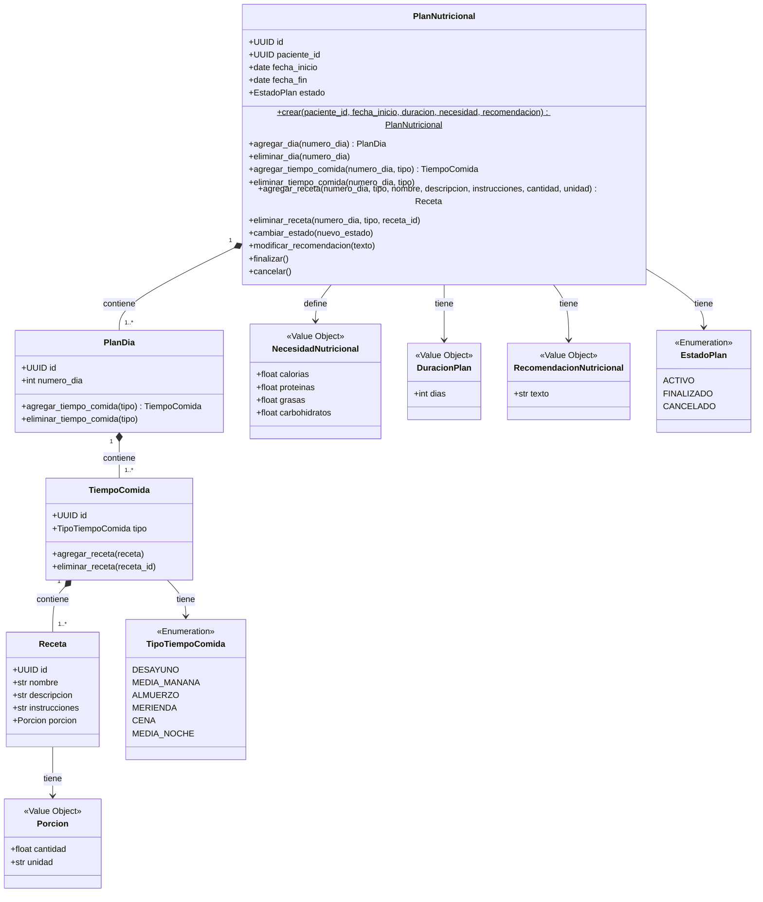
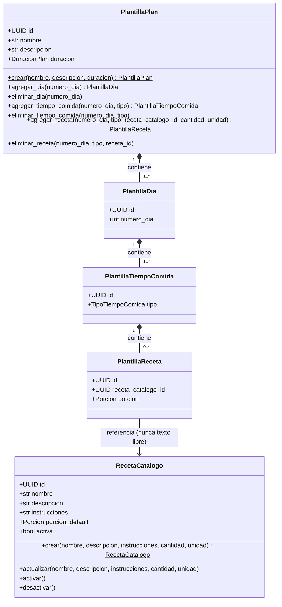

# ms-plan-nutricional — BC3 Planificación Nutricional

**Sistema:** NUR-TRICENTER — Sistema Integral de Gestión Nutricional  
**Responsable:** Luis Humberto Navarro Ribeiro  
**Bounded Context:** BC3 – Planificación Nutricional  
**Repositorio:** _<!-- TODO: reemplazar por la URL del repositorio GitHub -->_ `https://github.com/luishumbertonavarro/ms-plan-nutricional`

Microservicio desarrollado aplicando **Domain Driven Design (DDD)**, **Arquitectura Limpia (Clean Architecture)**
y **CQRS**, con separación estricta de comandos (escritura) y consultas (lectura). Expone una **API REST**
(FastAPI) que da acceso a todas sus funcionalidades. No incluye frontend, según lo permitido por el enunciado.

---

## Descripción

Este microservicio gestiona los **planes de alimentación personalizados** asignados a cada paciente.
El nutricionista elabora un plan estructurado por días, donde cada día contiene distintos tiempos
de comida (desayuno, almuerzo, cena, etc.) y cada tiempo de comida tiene asignadas una o varias
recetas con su porción correspondiente.

---

## Bounded Context y Lenguaje Ubicuo

| Término | Definición |
|---|---|
| **Plan Nutricional** | Programa alimenticio personalizado asignado a un paciente, con duración de 15 o 30 días. |
| **Plan Día** | Representación de un día dentro del plan, identificado por su número de día. |
| **Tiempo de Comida** | Ingesta diaria definida en el plan: desayuno, almuerzo, cena, etc. |
| **Receta** | Preparación culinaria específica asignada a un tiempo de comida. |
| **Porción** | Cantidad y unidad de una receta asignada al paciente (ej. 200 gr, 1 unidad). |
| **Necesidad Nutricional** | Requerimientos calóricos y de macronutrientes específicos del paciente. |
| **Duración del Plan** | Período válido del plan: solo se permiten 15 o 30 días. |
| **Recomendación Nutricional** | Indicaciones del nutricionista que guían la composición del plan. |
| **Estado del Plan** | Situación actual del plan: ACTIVO, FINALIZADO o CANCELADO. |
| **Receta de Catálogo** | Receta reutilizable, independiente de cualquier plan o plantilla, que sirve de fuente para poblar recetas en planes y plantillas. |
| **Plantilla de Plan** | Estructura base reutilizable de días/tiempos de comida/recetas (referenciando el catálogo) que el nutricionista usa para generar planes personalizados por paciente. |

---

## Historias de Usuario cubiertas

| HU | Requisito | Método del dominio |
|----|-----------|-------------------|
| HU-13 | Crear plan alimenticio personalizado (15/30 días) con recetas por tiempo de comida | `PlanNutricional.crear()` + `agregar_dia()`/`agregar_tiempo_comida()`/`agregar_receta()` |
| HU-14 | Gestionar catálogo de recetas reutilizables en distintos planes | `RecetaCatalogo` (CRUD en `/catalogo-recetas`) + `AgregarRecetaDesdeCatalogoUseCase` |
| HU-15 | Asignar plan base al paciente y personalizarlo | `CrearPlanDesdePlantillaUseCase` (copia la estructura de una `PlantillaPlan`; el plan resultante queda `ACTIVO` y editable) |
| HU-16 | Consultar recetas de un plan para un día específico | `GET /planes/{id}` → estructura anidada `dias → tiempos_comida → recetas` |
| HU-17 | Gestionar planes alimentarios base (plantillas) | CRUD sobre `PlantillaPlan` en `/plantillas` |
| HU-18 | Consultar plan de alimentación actual desde la app | `GET /planes/paciente/{paciente_id}` |

---

## Diagrama de Clases



> **Leyenda:**  
> `*--` composición (el hijo no existe sin el padre) · `-->` uso/asociación  
> `<<Value Object>>` inmutable y sin identidad propia · `$` método de fábrica (classmethod)

---

## Catálogo de Recetas y Plantillas de Plan

Dos agregados adicionales, independientes de `PlanNutricional`, que habilitan la reutilización (HU-14, HU-15, HU-17):

- **`RecetaCatalogo`**: receta reutilizable, con su propio ciclo de vida (`activa`/`inactiva`). Sirve de fuente
  tanto para agregar recetas a un plan de paciente (`.../recetas/desde-catalogo`) como para las plantillas.
- **`PlantillaPlan`**: estructura base de días → tiempos de comida → recetas, donde cada receta es siempre
  una *referencia* a `RecetaCatalogo` (nunca texto libre) — esto fuerza la reutilización real. No tiene
  ciclo de vida ACTIVO/FINALIZADO/CANCELADO: es catálogo, siempre editable.
- **`CrearPlanDesdePlantillaUseCase`**: genera un `PlanNutricional` para un paciente copiando la estructura
  de una `PlantillaPlan` (resolviendo cada receta contra el catálogo). El plan resultante queda `ACTIVO`,
  por lo que el nutricionista puede seguir personalizándolo con los casos de uso normales de `PlanNutricional`.



---

## Reglas de Negocio e Invariantes

### Invariantes del agregado (siempre se cumplen)

- Todo `PlanNutricional` pertenece a exactamente un paciente (`paciente_id`).
- Todo `PlanDia` pertenece a un único `PlanNutricional`.
- Todo `TiempoComida` pertenece a un único `PlanDia`.
- Toda `Receta` pertenece a un único `TiempoComida`.
- Una `Porcion` siempre debe ser válida (cantidad > 0).

### Reglas de negocio

| Regla | Descripción |
|---|---|
| Duración válida | Solo se permiten planes de 15 o 30 días (`DuracionPlan`) |
| Sin días duplicados | No pueden existir dos `PlanDia` con el mismo `numero_dia` |
| Sin recetas duplicadas | Un `TiempoComida` no puede tener la misma receta más de una vez |
| Plan no modificable si finalizado | No se pueden agregar días, tiempos ni recetas a un plan `FINALIZADO` o `CANCELADO` |
| Días dentro de la duración | No se puede agregar un día con `numero_dia` mayor a la duración del plan |
| Porción siempre positiva | La cantidad de una `Porcion` debe ser mayor que cero |
| Recomendación no vacía | `RecomendacionNutricional` no acepta texto vacío |
| Necesidad nutricional positiva | Ningún valor de `NecesidadNutricional` puede ser negativo |
| Receta de catálogo única por nombre | `catalogo_recetas.nombre` es único |
| Receta de catálogo inactiva no reutilizable | No se puede agregar a un plan ni a una plantilla si `activa = False` |
| Plantillas solo referencian catálogo | `PlantillaReceta` guarda `receta_catalogo_id`, nunca texto libre de receta |
| Días de plantilla dentro de la duración | Igual que en `PlanNutricional`, pero aplicado a `PlantillaPlan` |

---

## Excepciones de Dominio

| Excepción | HTTP | Situación |
|---|---|---|
| `PlanNoEncontradoError` | 404 | No existe un plan con el ID indicado |
| `DiaNoEncontradoError` / `TiempoComidaNoEncontradoError` / `RecetaNoEncontradaError` | 404 | El día/tiempo/receta no existe dentro del plan |
| `RecetaCatalogoNoEncontradaError` | 404 | No existe la receta de catálogo indicada |
| `PlantillaNoEncontradaError` / `PlantillaDiaNoEncontradoError` / `PlantillaTiempoComidaNoEncontradoError` / `PlantillaRecetaNoEncontradaError` | 404 | El recurso de plantilla indicado no existe |
| `PlanNoModificableError` | 409 | El plan no está `ACTIVO` |
| `TransicionEstadoInvalidaError` | 409 | Cambio de estado no permitido |
| `DiaDuplicadoError` / `TiempoComidaDuplicadoError` / `RecetaDuplicadaError` | 409 | Ya existe ese día/tiempo/receta en el plan |
| `PlantillaDiaDuplicadoError` / `PlantillaTiempoComidaDuplicadoError` | 409 | Ya existe ese día/tiempo en la plantilla |
| `RecetaCatalogoInactivaError` | 409 | La receta de catálogo está desactivada |
| `DiaFueraDeDuracionError` / `PlantillaDiaFueraDeDuracionError` | 422 | El número de día excede la duración del plan/plantilla |

---

## Datos de Otros Bounded Contexts (Mockups)

`ms-plan-nutricional` es **dueño exclusivo** de los datos de BC3 (Plan, Días, Tiempos, Recetas).
Los datos que **provienen de otros microservicios** se reciben a través de **interfaces (puertos)**
con implementaciones mock para desarrollo:

| Dato | Origen | Interfaz | Mock actual |
|---|---|---|---|
| Datos del paciente (nombre, código) | **ms-pacientes** (BC1) | `PacienteGateway` | Pendiente — infraestructura no implementada |
| Confirmación de contrato activo | **ms-contratos** (BC4) | referenciado por ID (UUID) | campo `paciente_id` en `PlanNutricional` |

Cuando los microservicios externos estén disponibles, basta reemplazar los mocks por implementaciones HTTP
sin tocar el dominio.

---

## Value Objects — Validaciones

| Value Object | Campo | Restricción |
|---|---|---|
| `DuracionPlan` | `dias` | Solo acepta 15 o 30 |
| `NecesidadNutricional` | `calorias`, `proteinas`, `grasas`, `carbohidratos` | Ninguno puede ser negativo |
| `RecomendacionNutricional` | `texto` | No puede estar vacío |
| `Porcion` | `cantidad` | Debe ser mayor que cero |
| `Porcion` | `unidad` | Ejemplos: `gr`, `ml`, `unidad` |

---

## Arquitectura — DDD, Clean Architecture y CQRS

Cómo se aplica cada principio en el código:

| Principio | Aplicación en este microservicio |
|---|---|
| **Domain Driven Design** | Capa `domain/` en Python puro (sin frameworks): Aggregate Roots (`PlanNutricional`, `RecetaCatalogo`, `PlantillaPlan`), entidades hijas, Value Objects inmutables, excepciones de dominio e interfaces de repositorio/gateway. Las invariantes se protegen dentro del agregado. |
| **Arquitectura Limpia** | Dependencias apuntando hacia adentro: `presentation → application → domain`. El dominio no conoce FastAPI ni SQLAlchemy; la infraestructura implementa los puertos (repositorios/gateways) definidos en el dominio. |
| **CQRS** | Separación explícita entre **comandos** (`application/commands/` + casos de uso que mutan estado) y **consultas** (`application/queries/` + `*_queries.py` que solo leen). Cada caso de uso es una clase con una única responsabilidad. |

```
src/plan_nutricional/
├── domain/                              ← Python puro, sin frameworks
│   ├── model/
│   │   ├── plan_nutricional.py          # Aggregate Root
│   │   ├── plan_dia.py                  # Entidad
│   │   ├── tiempo_comida.py             # Entidad
│   │   ├── receta.py                    # Entidad
│   │   ├── receta_catalogo.py           # Aggregate Root — catálogo reutilizable
│   │   ├── plantilla_plan.py            # Aggregate Root — plantillas + entidades hijas
│   │   ├── value_objects.py             # NecesidadNutricional, DuracionPlan, RecomendacionNutricional, Porcion
│   │   └── enums.py                     # EstadoPlan, TipoTiempoComida
│   ├── exceptions/                      # plan_exceptions.py, catalogo_exceptions.py, plantilla_exceptions.py
│   ├── repositories/                    # PlanNutricionalRepository, RecetaCatalogoRepository, PlantillaPlanRepository
│   └── gateways/                        # PacienteGateway (interfaz hacia BC1)
├── application/
│   ├── commands/                        # Dataclasses de comandos
│   ├── queries/                         # Dataclasses de consultas
│   └── use_cases/                       # Un archivo por caso de uso (planes, catálogo y plantillas)
├── infrastructure/
│   ├── persistence/                     # ORM models + repositorios (plan, catálogo, plantilla)
│   └── gateways/                        # PacienteGatewayMock
└── presentation/
    └── api/
        ├── routers/                     # planes.py, catalogo_recetas.py, plantillas.py
        └── schemas/                     # Schemas Pydantic + mappers
```

---

## Cómo Ejecutar

> Se requiere tener la base de datos PostgreSQL activa antes de iniciar la API.

```bash
# 1. Levantar PostgreSQL (crea la BD y las tablas automáticamente)
docker compose -f ms-plan-nutricional-docker-compose.yml up -d

# 2. Instalar dependencias
uv sync

# 3. Levantar la API
uv run fastapi dev main.py
# → disponible en http://localhost:8000
# → documentación Swagger en http://localhost:8000/docs
```

```bash
# Detener la base de datos
docker compose -f ms-plan-nutricional-docker-compose.yml down

# Ver logs de la BD
docker logs plan_nutricional_db

# Inspeccionar la BD manualmente
docker exec -it plan_nutricional_db psql -U postgres -d db_plan_nutricional
```

---

## Pruebas y Cobertura

La suite recoge **dos talleres**: pruebas unitarias (`tests/unit/`) y pruebas de
integración (`tests/integration/`).

```bash
# Instalar dependencias (grupo dev: pytest, pytest-asyncio, pytest-cov, httpx)
uv sync

# Toda la suite
uv run pytest -q

# Solo unitarias (no necesitan PostgreSQL) / solo integración (sí lo necesita)
uv run pytest tests/unit -q
uv run pytest tests/integration -v

# COBERTURA DE LA CAPA UNITARIA — el reporte oficial (umbral: 80 %)
uv run pytest tests/unit --cov --cov-report=term-missing \
    --cov-report=html:htmlcov-unit --cov-report=xml:coverage-unit.xml

# Cobertura de la suite completa (requiere PostgreSQL levantado)
uv run pytest --cov --cov-report=term-missing --cov-report=html:htmlcov
```

| Alcance | Detalle |
|---|---|
| Capa de Dominio | 121 tests — Value Objects, invariantes de los agregados, ciclo de vida del plan |
| Capa de Aplicación | 102 tests — los 22 casos de uso y los 7 query handlers, con **mocks** de los repositorios (`AsyncMock(spec=...)`) |
| Presentación (sin I/O) | 36 tests — mappers dominio→Pydantic, tabla excepción→HTTP y composición de la app |
| Infraestructura (sin I/O) | 5 tests — gateway de pacientes, determinista y sin red |
| Integración (API + BD) | 21 tests — `httpx.AsyncClient` contra la app FastAPI real y PostgreSQL, **sin mocks** |
| Entorno de pruebas | 13 tests que validan las reglas del propio entorno de integración (ver `tests/README.md` §9) |
| **Cobertura de la capa unitaria** | **84 %** de todo el microservicio, sin base de datos — evidencia en `htmlcov-unit/` y `coverage-unit.xml` |
| Cobertura de la suite completa | 89 %, con PostgreSQL levantado |

`pyproject.toml` fija `fail_under = 80`: la suite falla si la cobertura cae por
debajo del mínimo exigido. Los dos números no miden lo mismo y `tests/README.md`
§7.3 explica la diferencia — parte de lo que la capa unitaria cubre de
`infrastructure/` y `presentation/` es **cableado** (declaraciones de ruta,
columnas del ORM, campos Pydantic), mientras que los cuerpos de los repositorios
y de los endpoints solo los recorren las pruebas de integración.

**Pruebas unitarias.** No requieren PostgreSQL: los repositorios se sustituyen
por mocks, de modo que se ejecutan aisladas de la infraestructura. Cubren el
dominio y la aplicación al 100 %, y además la parte de `presentation/` e
`infrastructure/` que no hace I/O (funciones puras y cableado).

**Pruebas de integración.** Recorren el camino completo
`HTTP → router → caso de uso → repositorio → PostgreSQL → HTTP` sobre el agregado
`PlanNutricional`, con un flujo correcto de punta a punta y trece flujos
incorrectos que verifican el mapeo de cada error de dominio a su status HTTP.
Corren contra la **misma** `db_plan_nutricional` del docker-compose —no hace
falta ninguna base adicional— y aun así **no dejan ni una fila**: cada test se
envuelve en una transacción que se revierte al terminar. Si PostgreSQL no está
levantado se marcan como `skipped` y la suite no se rompe:

```bash
docker compose -f ms-plan-nutricional-docker-compose.yml up -d
uv run pytest tests/integration -v
```

**Los mismos flujos en Postman.** En `postman/` está la colección equivalente
(34 aserciones `pm.test`), para ejecutarla contra la API levantada. A diferencia
de pytest, estas peticiones **sí escriben** en la base, porque van por la red:

```bash
uv run fastapi dev main.py          # en otra terminal

newman run postman/ms-plan-nutricional.postman_collection.json \
       -e postman/ms-plan-nutricional.postman_environment.json
```

**Entorno de pruebas asistido por IA.** El repositorio incluye dos subagentes
especializados —`test-writer` (unitarias) e `integration-test-writer` (API y
persistencia)— con una skill de convenciones cada uno y alcances que no se
solapan. Lo que lo hace un entorno *validado* y no solo documentado: el flujo de
cada agente le obliga a ejecutar la suite y reportar la salida real, tiene
prohibido modificar `src/` para hacer pasar un test, y
`tests/integration/test_convenciones_del_entorno.py` comprueba automáticamente que
nadie introduzca mocks en integración, borre datos de la base o rompa el
aislamiento transaccional. Detalle completo en `tests/README.md` §9.

Ver **[tests/README.md](tests/README.md)** para el detalle: qué es un mock y cómo
se usa aquí, el patrón AAA, el inventario completo de la suite, cómo se montan las
pruebas de integración y los hallazgos.

---

## Estado Actual

| Componente | Estado |
|---|---|
| Capa de Dominio (AR, Entidades, VOs, Excepciones) | Completo — incluye `PlanNutricional`, `RecetaCatalogo` y `PlantillaPlan` |
| Interfaces de Repositorio y Gateway | Completo |
| Capa de Aplicación (casos de uso, queries) | Completo |
| Pruebas unitarias | 264 tests (dominio, casos de uso, mappers, manejadores de excepción, composición y gateways) · `pytest` + `unittest.mock` · **84 % de cobertura**, umbral `fail_under = 80` |
| Pruebas de integración | 21 tests sobre `/planes` (API + PostgreSQL reales, sin dejar datos) · `httpx` + colección Postman · cobertura de la suite completa 89 % |
| Entorno de pruebas para IA | 2 subagentes (`test-writer`, `integration-test-writer`) + 2 skills + guardián automático de 13 tests |
| API REST (FastAPI, endpoints, schemas) | Completo — `/planes`, `/catalogo-recetas`, `/plantillas` |
| Persistencia | PostgreSQL 16 vía SQLAlchemy async (activo) |
| Mensajería | Pendiente |
| Gateway Pacientes | Parcial — interfaz `PacienteGateway` definida y `PacienteGatewayMock` implementado y probado; falta la implementación HTTP real contra `ms-pacientes` |
| Base de datos | DDL en `bd-ms-plan-nutricional.sql` · se crea automáticamente con Docker |

---

## Stack Tecnológico

| Capa | Tecnología |
|---|---|
| Lenguaje | Python 3.12+ |
| HTTP | FastAPI + Uvicorn |
| Base de datos | PostgreSQL 16 vía SQLAlchemy 2.x async |
| Validación | Pydantic v2 |
| Contenedores | Docker + Docker Compose |
| Dependencias | `uv` con `pyproject.toml` |
| Pruebas | pytest + pytest-asyncio + pytest-cov · mocks con `unittest.mock.AsyncMock` · integración con `httpx.AsyncClient` y Postman/newman |
